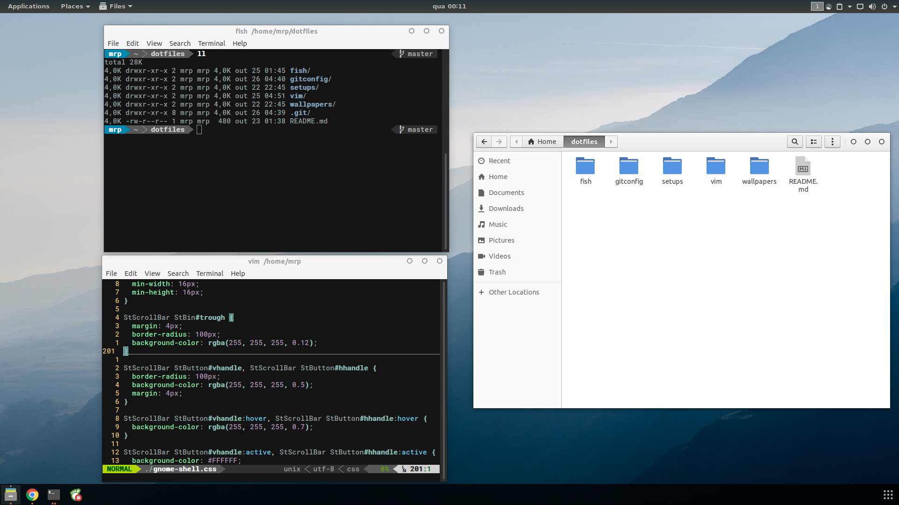

# dotfiles: [flat-af](https://www.reddit.com/r/unixporn/comments/7080ur/gnomeshell_flataf/)

trying to use [GNU stow](https://www.gnu.org/software/stow/) to manage all this shit.

setup:
- Ubuntu 17.10
- fish shell
- Powerline status line for fish and vim
- [Gogh's Hybrid](https://github.com/Mayccoll/Gogh/blob/master/content/themes.md#hybrid) Gnome Terminal profile
- Gnome extensions:
  - Clipboard Indicator
  - Frippery Applications Menu
  - Places Status Indicator
  - Status Area Horizontal Spacing
  - Steal My Focus
  - Transparent Notification
  - Ubuntu AppIndicators
  - Ubuntu Dock
  - User Themes
  - Dash to Panel
  - Minimize All
  - Removable Drive Menu
  - Workspace Indicator
  

