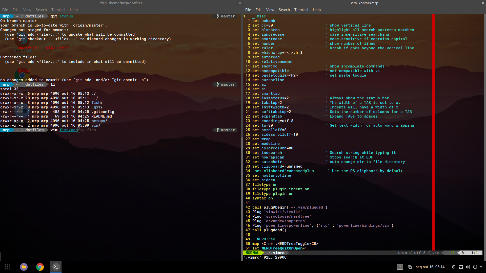

# dotfiles

trying to use [GNU stow](https://www.gnu.org/software/stow/) to manage all this shit.

adapted from [this configuration](https://github.com/Ullaakut/new-environment-bootstrap). inspired by the animation & screenshots on [this repository](https://github.com/EtixLabs/cameradar).

setup:
- Ubuntu 17.04 (Zesty Zapus) with Gnome Desktop
- Gnome extensions:
  - Dash to Panel
  - Minimize All
  - Removable Drive Menu
  - Workspace Indicator
  

